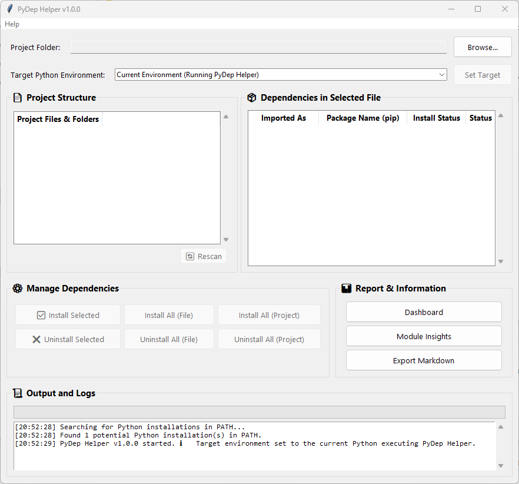

# PyDep Helper v1.0.0

A simple GUI tool (Tkinter) to scan Python projects, identify dependencies, check installation status, and manage packages. Helps keep track of what's needed in your Python environments!

<!--  -->

## Download

➡️ **Download the latest Windows executable (.exe) from the [Releases Page](https://github.com/nasrudinz/pydep-helper/releases)** ⬅️

## Features

*   Scan project folders recursively for Python dependencies (`import` statements).
*   Filter out standard library modules.
*   Map common import names to their correct PyPI package names (e.g., PIL -> pillow).
*   Check if dependencies are installed in a selected target Python environment.
*   Manage dependencies: Install/Uninstall (Selected, All for File, All for Project).
*   Automatically detect and suggest using project `.venv` if found.
*   Manually select any Python executable as the target environment.
*   View Dashboard summary (Installed vs. Not Installed).
*   View Module Insights (Which files use which package).
*   Export dependency report to Markdown format.

## How to Use

1.  Go to the [**Releases Page**](https://github.com/nasrudinz/pydep-helper/releases).
2.  Download the `PyDepHelper_v1.0.0.exe` file (or the latest version available).
3.  Run the downloaded `.exe` file. No installation is required.
4.  Click "**Browse...**" to select your Python project's root folder.
5.  The tool will scan the project. It might automatically select a Python environment (like a `.venv` inside your project) or you can select one using the dropdown and "**Set Target**" button.
6.  Click on a `.py` file in the "**Project Structure**" list (left pane).
7.  Dependencies found in that file will appear in the right pane with their installation status (✅/❌) relative to the **Target Python Environment**.
8.  Use the buttons under "**Manage Dependencies**" or "**Report & Information**" to perform actions.

## Requirements

*   Windows 10 / Windows 11 (64-bit recommended). Untested on older versions.

## License and Disclaimer

This program is provided as **freeware**. Please read the [**LICENSE.txt**](LICENSE.txt) file for terms of use.

**Use this software at your own risk. The author provides NO WARRANTY and accepts NO LIABILITY for any damages or issues arising from its use.**

## Support

If you find this tool useful and wish to support its future development, you can:
